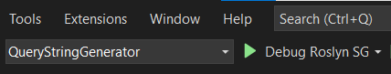

# Debugging Source Generator

1. Open the `QueryStringGenerator.sln` solution file to Visual Studio 2022
2. Set `QueryStringGenerator` project as a startup project
3. Activate `Debug Roslyn SG` launch profile (this profile is configured to debug QueryStringGenerator.App project).

After executing steps 1-3 the Visual Studio menu looks like

and you can set breakpoints, for example to `Initialize` and `Execute` methods, to source generator and hit F5 to start debugging.
